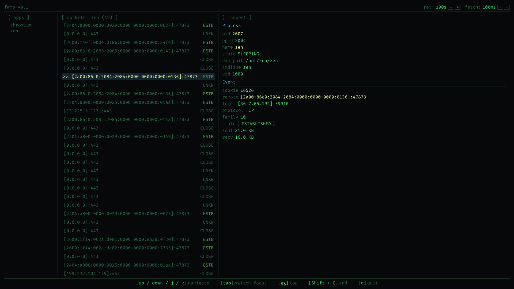

# fwmp

A Linux TCP network monitor written in [C3](https://c3-lang.org/), using eBPF for low-level socket observation and [Clay](https://github.com/nicbarker/clay) for the UI.

fwmp shows TCP connections grouped by the application that owns them, with detailed information available for individual sockets.

## Features

- Live TCP socket monitoring
- Socket state information
- Per-socket traffic statistics
- Process information for each connection
- Interactive TUI-style interface
- eBPF-based network observation

## Screenshot

## Process information

For sockets associated with an application, fwmp can expose:

- PID
- PPID
- Process name
- Process state
- Executable path
- Command line
- UID

This lets you move from a network connection directly to the process responsible for it.

## eBPF

fwmp uses eBPF to observe TCP socket activity directly from the kernel.

The current probes are:

```text
tcp_set_state
tcp_sendmsg
tcp_cleanup_rbuf
tcp_v4_connect
tcp_v6_connect
inet_csk_accept
inet_bind
inet_listen
tcp_close
```

The eBPF side emits a compact event containing socket and process information:

```c
struct event {
    __u32 pid;
    __u32 tid;

    __u8 family;
    __u8 protocol;

    __u16 local_port;
    __u16 remote_port;

    __u8 local_addr[16];
    __u8 remote_addr[16];

    __u64 timestamp_ns;
    enum event_type type;
    __u64 sock_cookie;
    __u8 state;
};
```

The socket cookie is used to correlate events belonging to the same socket across the different probes.

Traffic calculation is also performed from eBPF, with transmitted and received byte counts associated with the socket cookie.

## Architecture

```text
                 Linux kernel
                      │
                      ▼
                   eBPF
                      │
        ┌─────────────┴─────────────┐
        │                           │
   socket events              traffic stats
        │                           │
        └─────────────┬─────────────┘
                      ▼
                    C3
                      │
          ┌───────────┼───────────┐
          │           │           │
      sock_map    process_map  app_map
          │           │           │
          └───────────┼───────────┘
                      ▼
                NetworkSnapshot
                      │
                      ▼
                    Clay
                      │
                      ▼
                     UI
```

## Requirements

- Linux
- Root access
- [C3 Compiler](https://c3-lang.org/getting-started/prebuilt-binaries/)
- Kernel with eBPF support

## Installation 
 - Download binary from [link](https://github.com/vamsi200/fwmp/releases/)
 - Make it executable:
     - ```bash
       chmod +x fwmp-x86_64.AppImage
       ```
  - Run it:
      ```bash
      sudo ./fwmp-x86_64.AppImage
      ```

## Building

The repository contains a `build.sh` script for building and running fwmp in project root. 

Because fwmp uses eBPF and accesses kernel/process information, it should be run with root privileges:

```bash
sudo ./build.sh
```

## Controls

Navigation can be performed using the arrow keys or Vim-style keys:

```text
[up / down / j / k]    navigate

[tab]                  switch focus

[gg]                   go to top

[Shift + G]            go to end
```

## Roadmap

### Application-layer information

Future versions will add higher-level information about individual connections, including:

- Hostname
- CNAME
- DNS resolver
- Protocol details
- TLS certificate information
